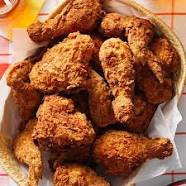

# 3. Prepare the best recipe ever

**Double Fried Chicken Preparation**

Marinate chicken pieces in buttermilk for at least 2 hours, then dredge in a mixture of flour, spices, and seasonings. Fry the chicken in vegetable oil until golden brown, then drain and fry a second time for extra crispiness. For a detailed recipe and step-by-step guide, visit [this link](https://www.allrecipes.com/recipe/8805/crispy-fried-chicken/). 


