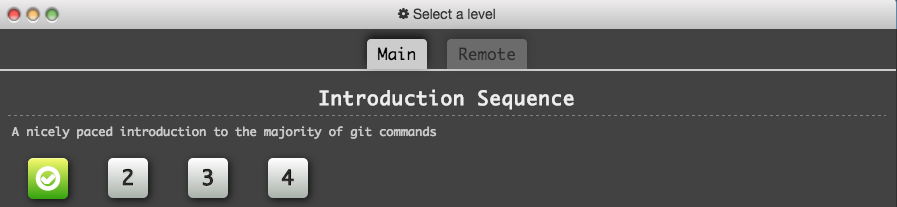
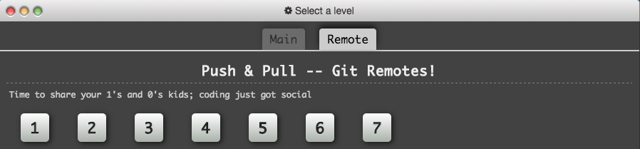

# E17: Experience Learn Git Branching

For this experience, use the [Learn Git Branching](https://pcottle.github.io/learnGitBranching/) site to get comfortable with basic ideas of git.

At a minimum, go through the 4 introductory levels in the Main area:

As well as the 7 levels explaining Push and Pull in the Remote area:

To get started using the site, just read the first dialog box that appears, then click the green right arrow button to advance to the next dialog box.

## Submission instructions

You do not have to submit anything for this experience, but your knowledge of git branching will be assessed in class, so be sure to finish this experience.
