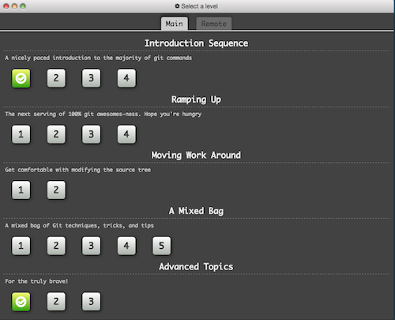

# In Class: Learn Git Race (<tt>https://goo.gl/bNa5J3</tt>)

Open up your laptops and bring up the [Learn Git Branching](https://pcottle.github.io/learnGitBranching/) site.

Wait until I say "go" to start.

Starting with the "Introduction Sequence" on the Main tab, begin solving levels.  You should work through the levels by typing the exact same git command into your respective browsers at the same time.  Agree upon what to type before typing. Do not allow one team member to "get ahead" of the other.

When you have finished a challenge, raise your hands to indicate. You are on the honor system, don't cheat! I will update the whiteboard to indicate the status of the race.
