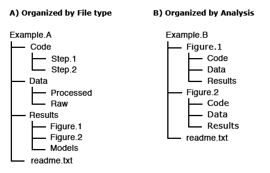

# FAIR: Reusable
This section will describe what it means for research to be reusable

<i class="fa-solid fa-user-pen fa-xl"></i>  **Exercise: Thanks but no thanks!**

In groups discuss:

- Have you ever received data you couldn’t use? Why or why not?
- Have you tried replicating an experiment, yours or someone else? What challenges did you face?

## For data & software to be reusable:

* (Meta) data have a plurality of accurate and relevant attributes  
* (Meta) data are released with a clear and accessible data usage licence  
* (Meta) data are associated with their provenance  
* (Meta) data meet domain-relevant community standards

## File naming best practices

A file name should be unique, consistent and descriptive. This allows for increased visibility and discoverability and can be used to easily classify and sort files. Remember, a file name is the primary identifier to the file and its contents.

### Do’s:

- Make use of file naming tools for bulk naming such as Ant Renamer, RenameIT or Rename4Mac.
- Create descriptive, meaningful, easily understood names no less than 12-14 characters.
- Use identifiers to make it easier to classify types of files i.e. Int1 (interview 1)
- Make sure the 3-letter file format extension is present at the end of the name (e.g. .doc, .xls, .mov, .tif)
- If applicable, include versioning within file names
- For dates use the  ISO 8601  standard: YYYY-MM-DD and place at the end of the file number UNLESS you need to organise your files chronologically.
- For experimental data files, consider using the project/experiment name and conditions in abbreviations
- Add a README file in your top directory which details your naming convention, directory structure and abbreviations
- - When combining elements in file name, use common [special letter case](https://en.wikipedia.org/wiki/Letter_case#Special_case_styles) patterns such as Kebab-case, CamelCase, or Snake*case, preferably use hyphens (-) or underscores (*)

### Don’ts:

- Avoid naming files/folders with individual persons names as it impedes handover and data sharing.
- Avoid long names
- Avoid using spaces, dots, commas and special characters (e.g. ~ ! @ # $ % ^ & \* ( ) ; < > ? , [ ] { })
- Avoid repetition for ex. Directory name Electron_Microscopy_Images, then you don’t need to name the files ELN_MI_Img_20200101.img

#### Examples:

- Stanford Libraries [guidance on file naming](https://library.stanford.edu/spc/university-archives/managing-university-records/file-naming-guidelines) is a great place to start.
- [Dryad example](https://datadryad.com/pages/reusabilityBestPractices):
- 1900-2000_sasquatch_migration_coordinates.csv
- Smith-fMRI-neural-response-to-cupcakes-vs-vegetables.nii.gz
- 2015-SimulationOfTropicalFrogEvolution.R

## Directory structures and README files

A clear directory structure will make it easier to locate files and versions and this is particularly important when collaborating with others. Consider a hierarchical file structure starting from broad topics to more specific ones nested inside, restricting the level of folders to 3 or 4 with a limited number of items inside each of them.

The UK data services offers an example of directory structure and naming: [https://ukdataservice.ac.uk/manage-data/format/organising.aspx](https://ukdataservice.ac.uk/manage-data/format/organising.aspx)

For others to reuse your research, it is important to include a README file and to organize your files in a logical way. Consider the following file structure examples from Dryad:

It is also good practice to include README files to describe how the data was collected, processed, and analyzed. In other words, README files help others correctly interpret and reanalyze your data. A README file can include file names/directory structure, glossary/definitions of acronyms/terms, description of the parameters/variables and units of measurement, report precision/accuracy/uncertainty in measurements, standards/calibrations used, environment/experimental conditions, quality assurance/quality control applied, known problems, research date information, description of relationships/dependencies, additional resources/references, methods/software/data used, example records, and other supplemental information.

<i class="fa-solid fa-circle-info fa-xl"></i> **For more information**

* Dryad README file example: <https://doi.org/10.5061/dryad.j512f21p>
* Awesome README list (for software): <https://github.com/matiassingers/awesome-readme>
* Data Format Types: <https://data.library.virginia.edu/data-management/plan/format-types/>

## Disciplinary Data Formats

Many disciplines have developed formal metadata standards that enable re-use of data; however, these standards are not universal and often it requires background knowledge to indentify, contextualize, and interpret the underlying data. Interoperability between disciplines is still a challenge based on the continued use of custom metadata schmes, and the development of new, incompatiable standards. Thankfully, DataCite is providing a common, overarching metadata standard across disciplinary datasets, albeit at a generic vs granular level.

In the meantime, the Research Data Alliance (RDA) Metadata Standards Directory - Working Group developed a collaborative, open directory of metadata standards, applicable to scientific data, to help the research community learn about metadata standards, controlled vocabularies, and the underlying elements across the different disciplines, to potentially help with mapping data elements from different sources.

[Metadata Standards Directory](https://rd-alliance.github.io/metadata-directory/standards/)  
Features: Standards, Extensions, Tools, and Use Cases

## Quality Control

Quality control is a fundamental step in research, which ensures the integrity of the data and could affect its use and reuse and is required in order to identify potential problems.

It is therefore essential to outline how data collection will be controlled at various stages (data collection,digitisation or data entry, checking and analysis).

## Versioning

In order to keep track of changes made to a file/dataset, versioning can be an efficient way to see who did what and when, in collaborative work this can be very useful.

A version control strategy will allow you to easily detect the most current/final version, organize, manage and record any edits made while working on the document/data, drafting, editing and analysis.

Consider the following practices:

- Outline the master file and identify major files for instance; original, pre-review, 1st revision, 2nd revision, final revision, submitted.
- Outline strategy for archiving and storing: Where to store the minor and major versions, how long will you retain them accordingly.
- Maintain a record of file locations, a good place is in the README files

Example:
UK Data service version control guide:
[https://www.ukdataservice.ac.uk/manage-data/format/versioning.aspx](https://www.ukdataservice.ac.uk/manage-data/format/versioning.aspx)

## Research vocabularies

* Research Vocabularies Australia [https://vocabs.ands.org.au/](https://vocabs.ands.org.au/)
* AGROVOC & VocBench [https://aims.fao.org/vest-registry/vocabularies/agrovoc](https://aims.fao.org/vest-registry/vocabularies/agrovoc)
* Versioning/SHA: [https://swcarpentry.github.io/git-novice/reference](https://swcarpentry.github.io/git-novice/reference)
* Binder - executable environment, making your code immediately reproducible by anyone, anywhere: [https://blog.jupyter.org/binder-2-0-a-tech-guide-2017-fd40515a3a84](https://blog.jupyter.org/binder-2-0-a-tech-guide-2017-fd40515a3a84)
* Narrative & Documentation: Jupyter Notebooks
[https://www.contentful.com/blog/2018/06/01/create-interactive-tutorials-jupyter-notebooks/](https://www.contentful.com/blog/2018/06/01/create-interactive-tutorials-jupyter-notebooks/)
* Licenses: From GitHub [https://blog.github.com/2015-03-09-open-source-license-usage-on-github-com/](https://blog.github.com/2015-03-09-open-source-license-usage-on-github-com/)
* TIB Hannover Slides on license content: [https://docs.google.com/presentation/d/1mSeanQqO0Y2khA8KK48wtQQ_JGYncGexjnspzs7cWLU/edit#slide=id.g3a64c782ff_1_138](https://docs.google.com/presentation/d/1mSeanQqO0Y2khA8KK48wtQQ_JGYncGexjnspzs7cWLU/edit#slide=id.g3a64c782ff_1_138)

<i class="fa-solid fa-circle-info fa-xl"></i> **For more information**

* Choose an open source license: [https://choosealicense.com/](https://choosealicense.com/)
* 4 Simple recommendations for Open Source Software [https://softdev4research.github.io/4OSS-lesson/](https://softdev4research.github.io/4OSS-lesson/)
* Top 10 FAIR Imaging [https://librarycarpentry.org/Top-10-FAIR//2019/06/27/imaging/](https://librarycarpentry.org/Top-10-FAIR//2019/06/27/imaging/)
* Licensing your work: [https://librarycarpentry.org/Top-10-FAIR//2019/06/27/imaging/#9-licensing-your-work](https://librarycarpentry.org/Top-10-FAIR//2019/06/27/imaging/#9-licensing-your-work)
* The Turing Way a Guide for reproducible Research: [https://the-turing-way.netlify.app/welcome](https://the-turing-way.netlify.app/welcome)
* The Open Science Training Handbook: [https://open-science-training-handbook.gitbook.io/book/](https://open-science-training-handbook.gitbook.io/book/)
* Open Licensing and file formats [https://open-science-training-handbook.gitbook.io/book/open-science-basics/](https://open-science-training-handbook.gitbook.io/book/open-science-basics/)
* DCC How to license research data [https://www.dcc.ac.uk/guidance/how-guides/license-research-data](https://www.dcc.ac.uk/guidance/how-guides/license-research-data)

The content of this chapter was adapted from: [https://librarycarpentry.org/lc-fair-research](https://librarycarpentry.org/lc-fair-research).

<i class="fa-solid fa-circle-info fa-xl"></i> **Bio Break!**

Let's take a brief break to stretch before moving on to the next page.  See you in a few minutes.


