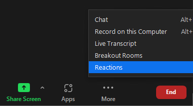

## Preparation 

Here are the things you need to do to be prepared for this workshop.

### Have command line experience

We recommend you go through the [Software Carpentry shell-novice tutorial](https://swcarpentry.github.io/shell-novice/) if you are new to the command-line.

The video [Introduction to Shell for Data Science](https://www.youtube.com/watch?v=V7TfE8_F_oc) also provides helpful information.

### Enable UH Multi-factor authentication

You must enable MFA on your UH account to use Mana. You can do that at [https://www.hawaii.edu/its/uhlogin/](https://www.hawaii.edu/its/uhlogin/).

### Obtain an account on Mana

If you do not already have an account on Mana, please go to the [Mana Home Page](https://datascience.hawaii.edu/hpc/) for instructions.

### Install a modern web browser

We recommend [Chrome](https://www.google.com/chrome/) or [Firefox](https://www.mozilla.org/en-US/firefox/).  Internet Explorer is not recommended.

### Download the workshop Jupyter notebook

Please download [participants-copy.ipynb](code/participants-copy.ipynb) to your local computer (use "save as", i.e. right click).

### How to provide feedback during the workshop

We encourage participants to write comments and questions in chat and use the <a href="https://support.zoom.us/hc/en-us/articles/115001286183-Nonverbal-feedback-during-meetings#:~:text=To%20provide%20nonverbal%20feedback%20or,icon%20again%20to%20remove%20it." target="_blank" >non-verbal feedback features of zoom</a>.

If at any time you have a question that is easier to talk through than writing it in chat, please indicate in chat you have a question or raise your virtual hand so that we know you wish to speak.

