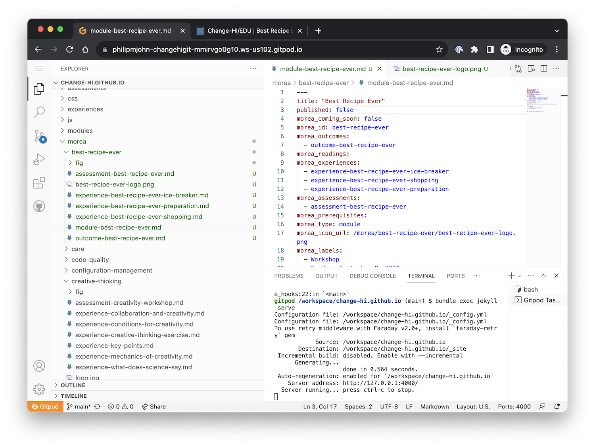
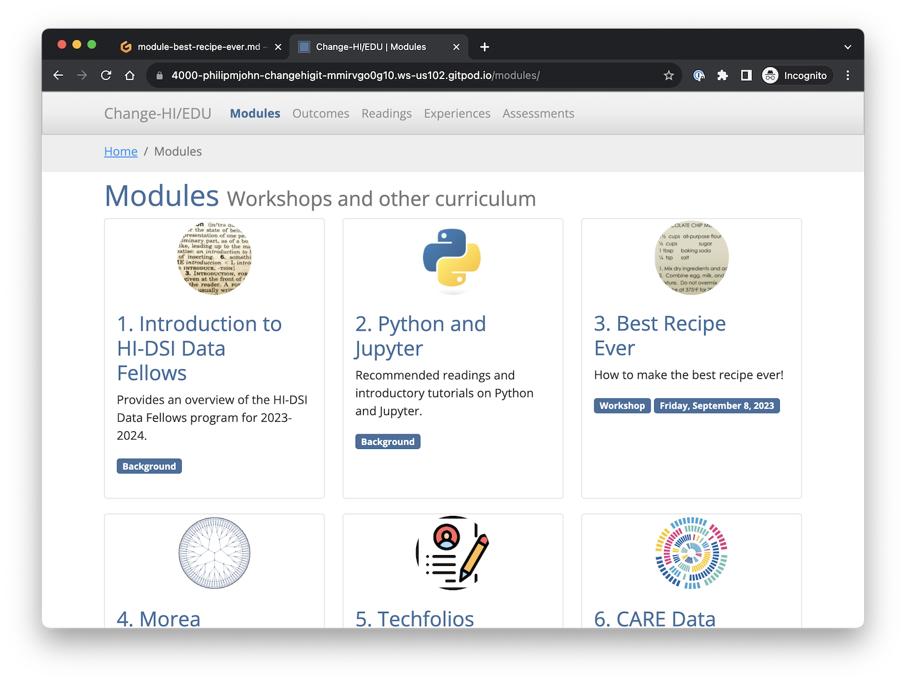
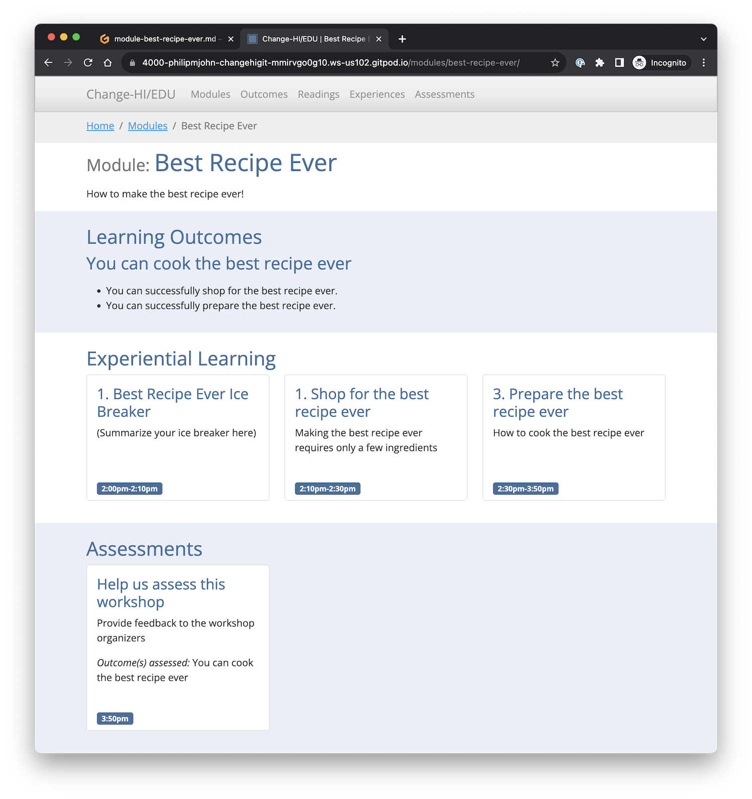

# 4. Workshop Development

If you've gotten this far, you should now have your own personal version of the Change-HI workshop site running in your own browser. 

In this section, you'll start to learn how to add content to build your own workshop. 

<i class="fa-solid fa-globe fa-xl"></i> **Best Recipe Ever!**

There is a "secret" module in the Change-HI repository called "Best Recipe Ever". It is unpublished by default.  In this part of the workshop, you are going to edit this module to create a simple workshop that teaches everyone how to cook (what you consider to be) the best recipe ever!

## Publish the Best Recipe Ever workshop module

Open the morea directory in your browser-based VS Code editor, then open the file named "module-best-recipe-ever.md". You should see something like the following displayed in your browser:

Line 2 of this file contains `published: false`.  That's why this module is secret. Edit this line to be `published: true`, then type command-S to save the file. 

Now, do the following:

 * Click the mouse inside the Terminal window to make it the active window
 * Type `control-c` (to stop the running process)
 * Type `control-p` (to redisplay the last command).
 * Press `return` (to re-run the last command (`bundle exec jekyll serve`))

If all goes well, you've restarted Jekyll and the last line in the Terminal window is "Server running... press control-c to stop".

Switch to your browser tab displaying the site, click on the "Modules" link, and you should now see the Best Recipe Ever workshop:

Click this link to see the contents:

## Code walkthrough

<i class="fa-solid fa-globe fa-xl"></i> **Sit back and relax**

Let the instructor give you a guided tour of the Best Recipe Ever module.

<i class="fa-solid fa-circle-info fa-xl"></i> **Bio Break!**

Let's take a brief break to stretch before moving on to the next page.  See you in a few minutes.


