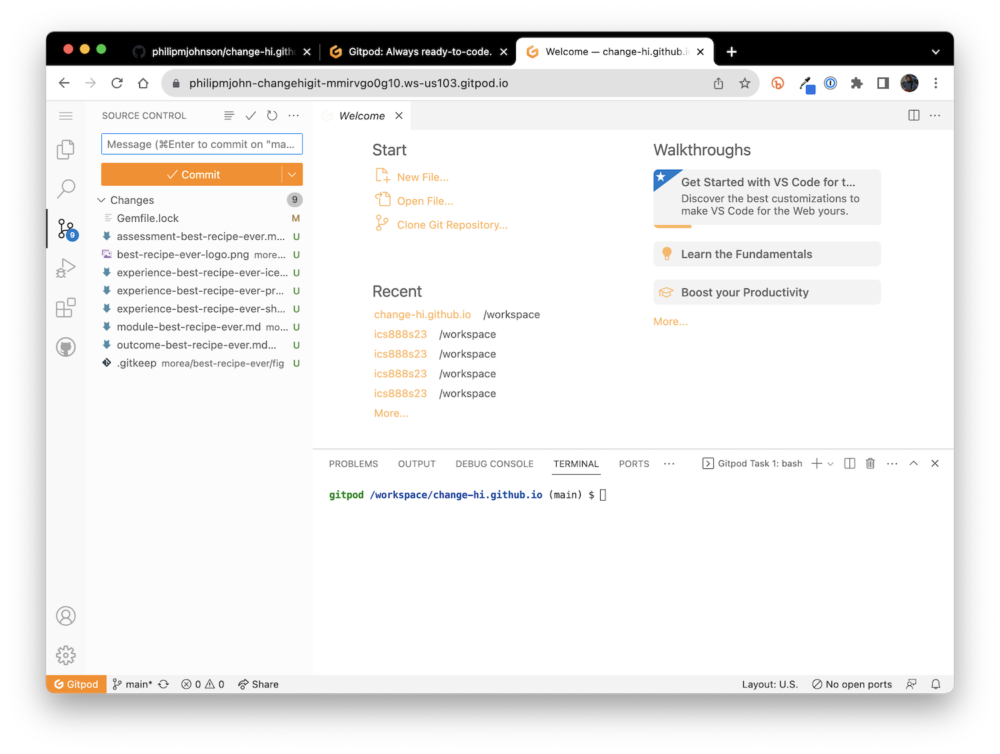
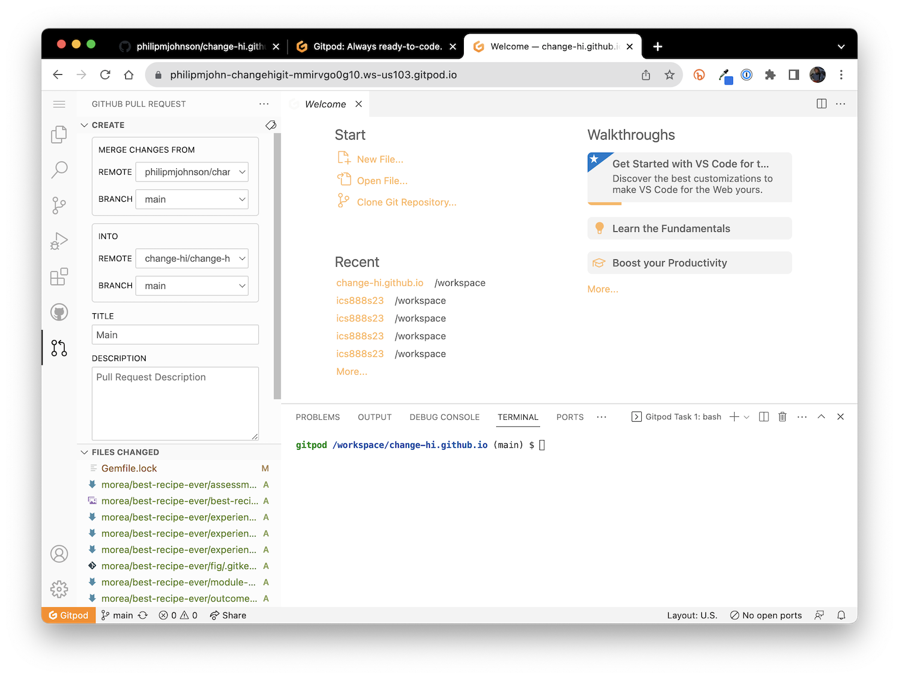
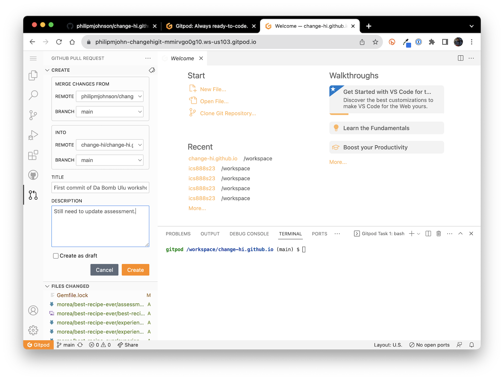
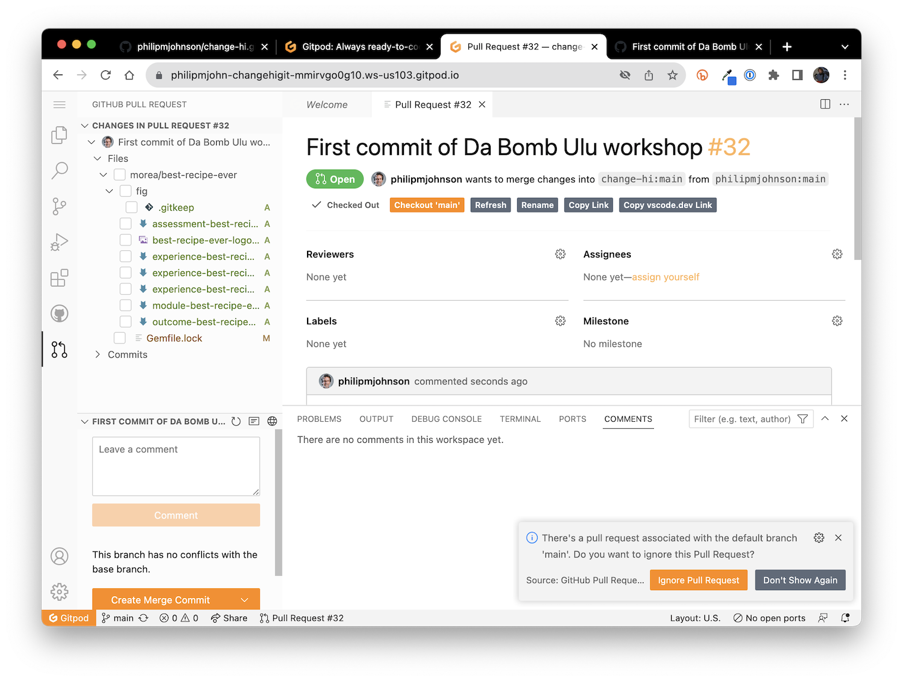

# 6. Workshop Development, Part 3

In this section, you'll commit your changes and make a pull request so that the Change-HI administrators can merge your workshop into the published site. 

## Commit your changes to your fork of the change-hi.github.io repository

After having edited files in the best-recipe-ever directory, you should see a notification disk on the left side of your browser window next to the Source Control icon. If you click on it, it should reveal the Source Control changes pane and a summary of what you've done. For example:

Type an informative message into the Message text field, then click the down arrow beside the Commit button to reveal additional choices. You want to select "Commit and create pull request":

Once you've selected that option, Gitpod will display a window with details on the pull request to be created:

Replace the "Title" field with something informative, such as the name of your workshop and what is being committed. You can leave the description field blank, or else add more details there. 

Scroll down (if necessary) to reveal the "Create" button, and click it:

If all goes well, you should see a summary of your pull request displayed in the window like this:

You're done!  The Change-HI administrators should be notified of your pull request. If you haven't heard anything within a day or two, please email them. (The current administrator is Philip Johnson, johnson@hawaii.edu)


