# 3. Workshop Setup

Now that you've learned a bit about best practices for workshop design, we're going to dive into the weeds with the mechanics of building a workshop for the HI-DSI workshop series. 

## Workflow overview

In general, the process looks like this:

1. You will make a *fork* of the Change-HI GitHub repository.
2. You create the contents of your workshop within your local fork.
3. When you have a version ready to use or review, you create a *pull request*. Your pull request will be reviewed by a Change-HI administrator, and if there are no significant problems, your pull request will be *merged* into the Change-HI repository.
4. After merging, your workshop is *published* and ready for use at <https://change-hi.github.io>.


<div class="alert alert-info" role="alert" markdown="1">
<i class="fa-solid fa-circle-info fa-xl"></i> **Fork? Pull request?**
<hr/>

If you'd like to learn more about these concepts, see GitHub's documentation on [About Forks](https://docs.github.com/en/pull-requests/collaborating-with-pull-requests/working-with-forks/about-forks) and [Creating a Pull Request](https://docs.github.com/en/pull-requests/collaborating-with-pull-requests/proposing-changes-to-your-work-with-pull-requests/creating-a-pull-request).

</div>

Let's now step through each of these steps.

## Make a fork of change-hi.github.io

In a browser, go to <https://github.com/change-hi/change-hi.github.io>. Make sure you are logged in to your GitHub account. (If you don't have a GitHub account, you need to create one now by going to <https://github.com/join>.) The page looks like this:

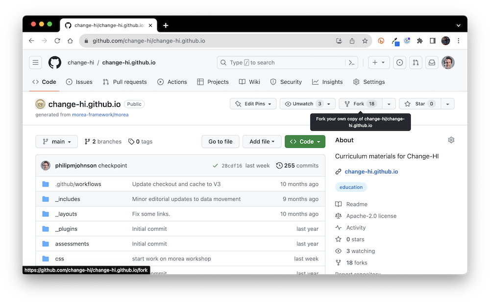

Click the "Fork" button in the top right of the page to bring up the fork window:

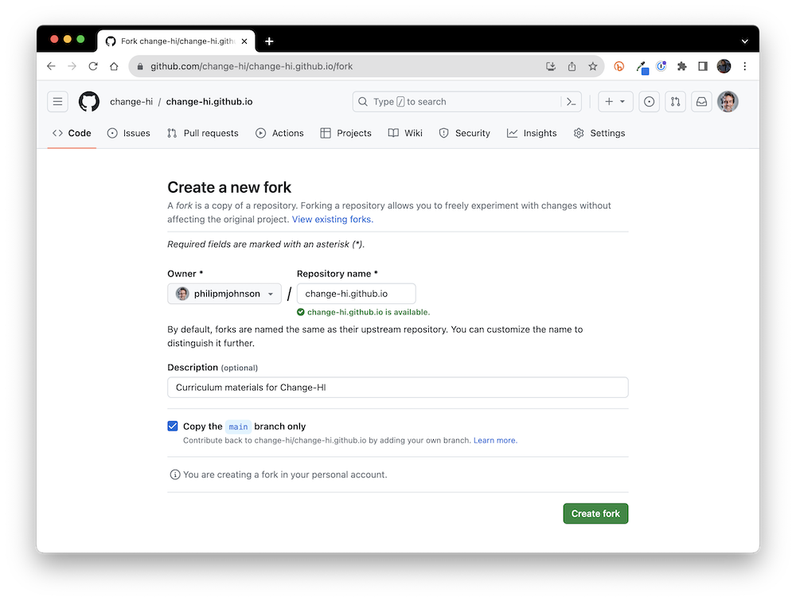


You can see that this window selects your personal account by default, which is typically where you'll want the fork of the repository to go. Click "Create fork" which results in a new copy of the repo in your own personal account. For example:

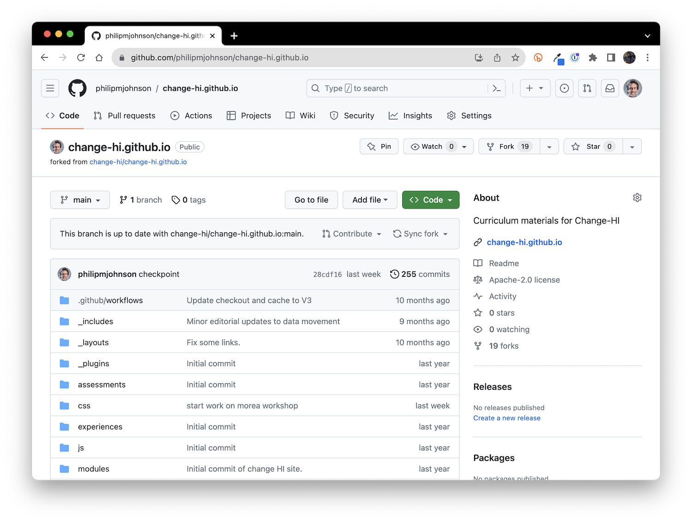

## Set up Gitpod

We recommend that you develop your workshop using a cloud-based based package called Gitpod. Basically, Gitpod provides a unix box pre-installed with all the tools you need to develop your Morea site in the cloud. You access everything through a browser, and edit your site using a browser-based version of Visual Studio Code.  (If, at some later point, you want to switch to local development, you can find out more at [Morea Framework Local Development](https://morea-framework.github.io/docs/category/local-development)).

### Login to GitPod

To start, go to <https://gitpod.io/>:

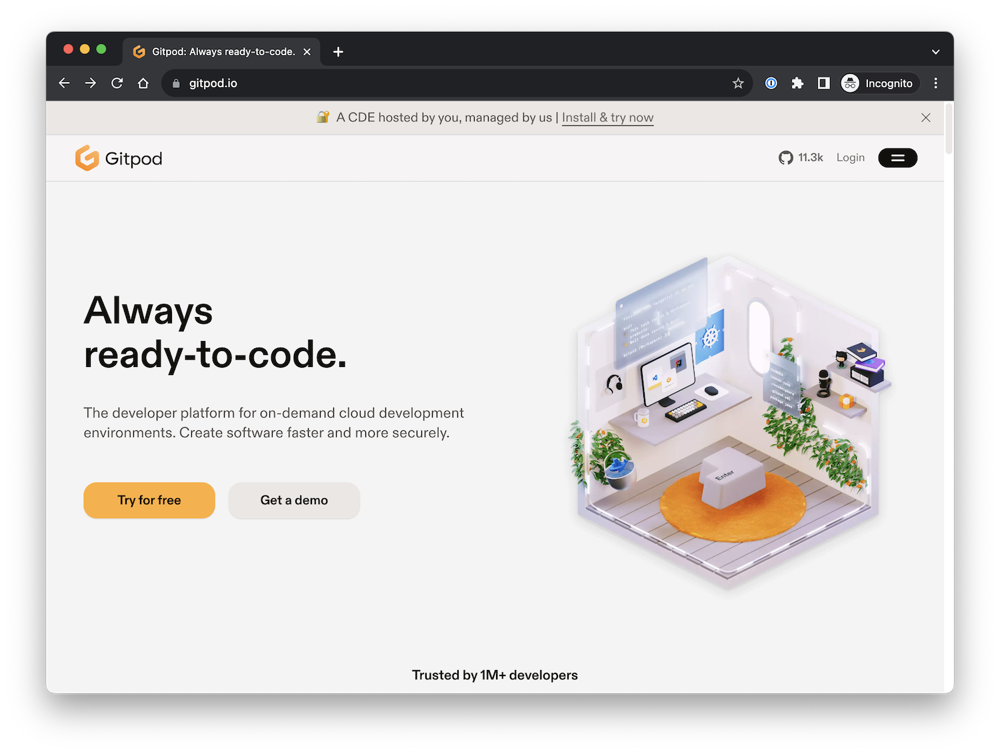

Click the Login button to go to the Login page:


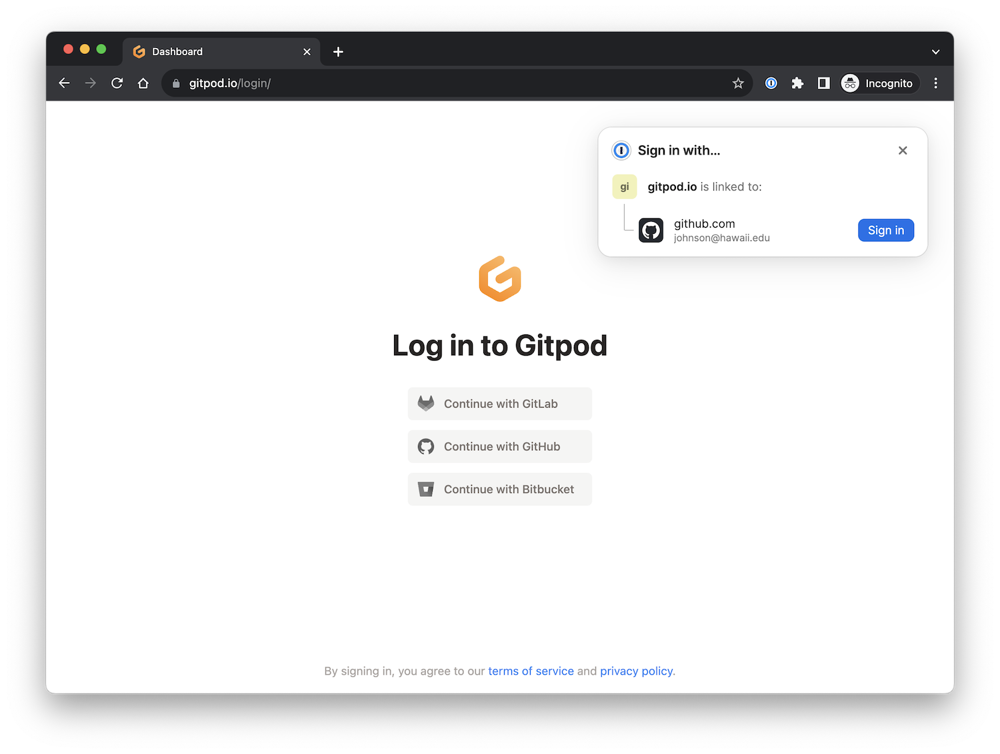

You want to "Continue with GitHub". (In my case, since I've used Gitpod before, it suggests that path automatically).

### Create a Gitpod workspace 

After continuing with GitHub, you should be on the "Workspaces" page:

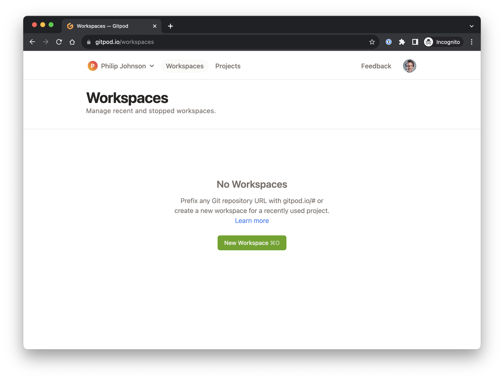

Click the "New Workspace" button. This will display a new window and ask that you select one of your repositories. You want to select your forked version of change-hi.github.io:

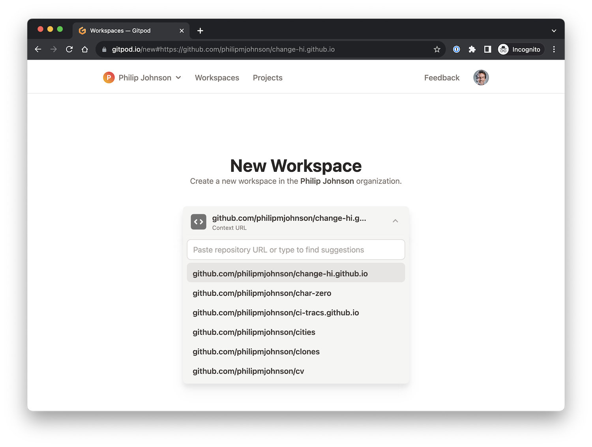

After you do that, you should see a page like this containing the options for creating a new workspace:

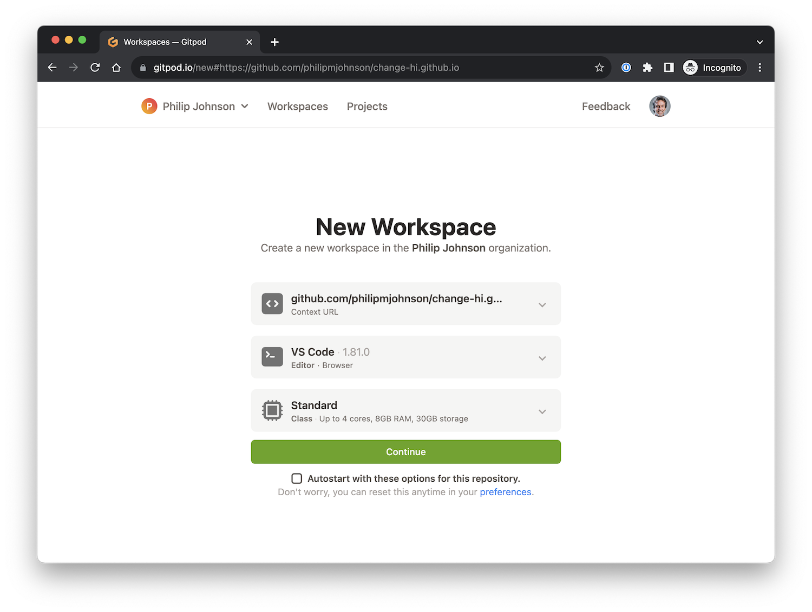

The default options (VS COde, Standard) are perfectly fine. You can go ahead and click the "Autostart with these options for this repository", and then click "Continue". 

A new screen will pop up that displays a cloud-based version of the VS Code editor.  There will be an open Terminal window with some green text scrolling by as various tools and libraries are installed. Just sit tight (1-2 minutes) until this installation finishes. You'll know it's done because you'll see a unix command prompt (in blue) at the bottom of the screen:

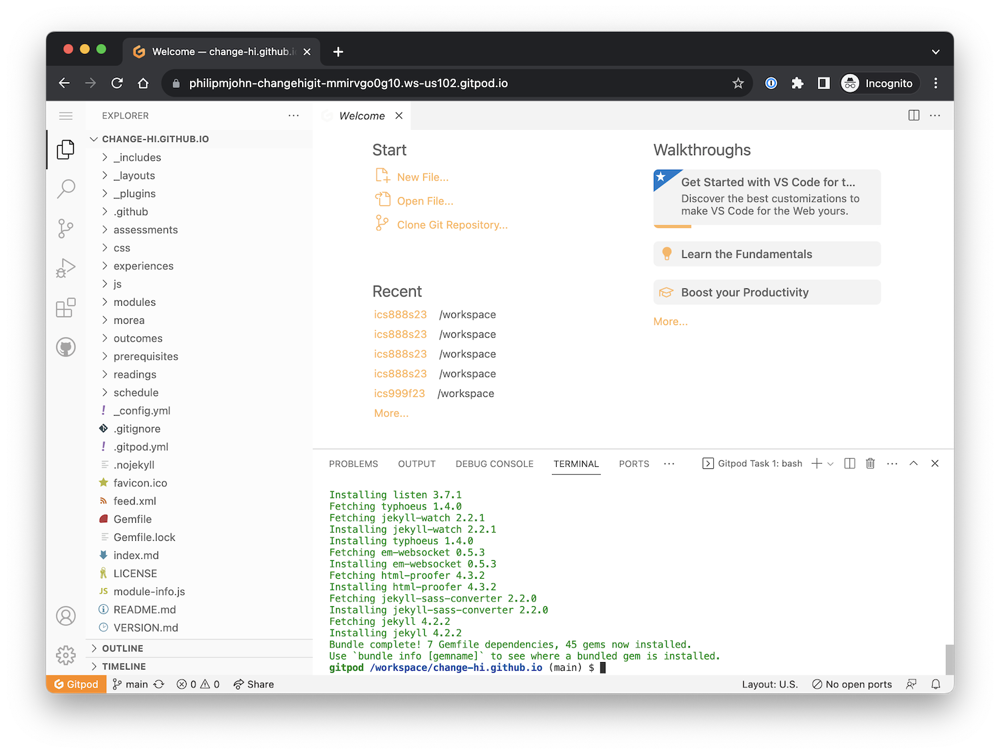


## Build and view the site

Now you can type `bundle exec jekyll serve` to build the site:

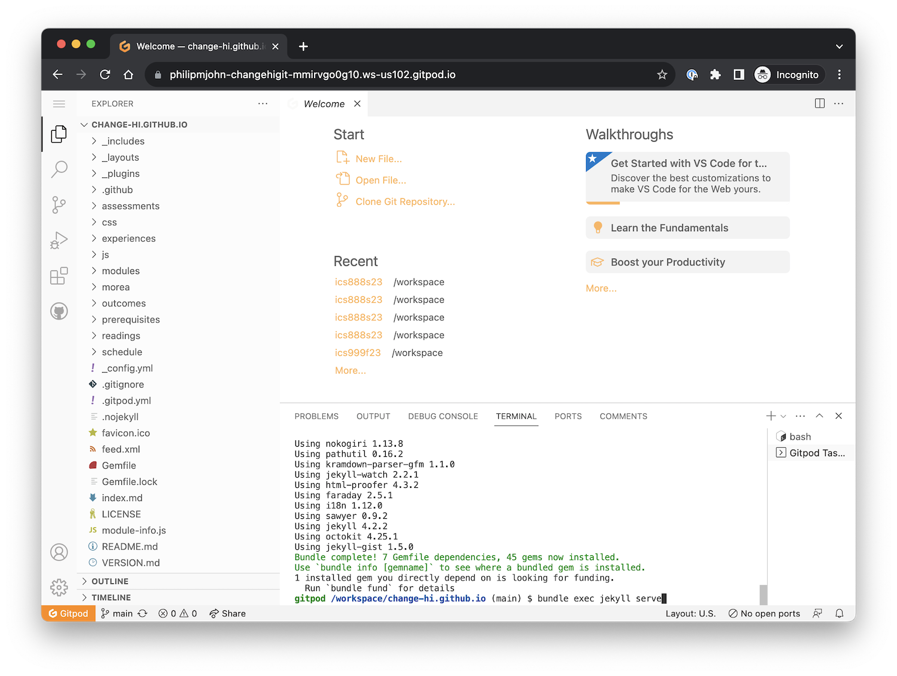

<div class="alert alert-warning" role="alert" markdown="1">
<i class="fa-solid fa-triangle-exclamation fa-xl"></i> **Yikes! What is this "nokogiri" stuff?**
<hr/>

It's unlikely, but possible to get an error such as "Could not find nokogiri-1.13.8-x86_64-linux in locally installed gems" after you run `bundle exec jekyll serve`. If that happens, try typing the following into your Terminal window:

```shell
rm Gemfile.lock
bundle install
bundle exec jekyll serve
```
This should fix the problem. 
</div>

You may see a pop up window noting that "A service is available on port 4000". Click the orange button labeled "Make public".

After that, the terminal window should look like the following, where the last line is "Server running... press control-c to stop":


If you put your mouse over the Server address, you will get a "Follow link" popup:

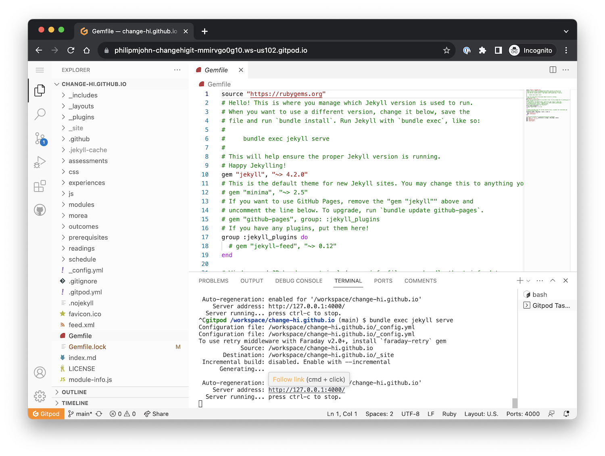

Click the "Follow link" popup button and your own, personal, local copy of the Change-HI repo will be displayed in your browser:

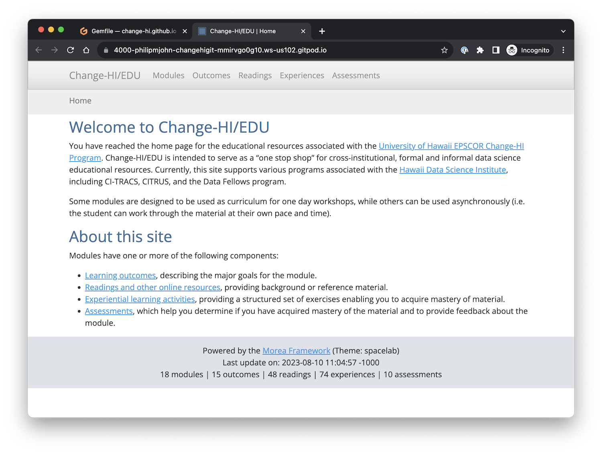

Congratulations!  You have now installed your own copy of the workshop repo and you are ready to start adding the content for your workshop.


