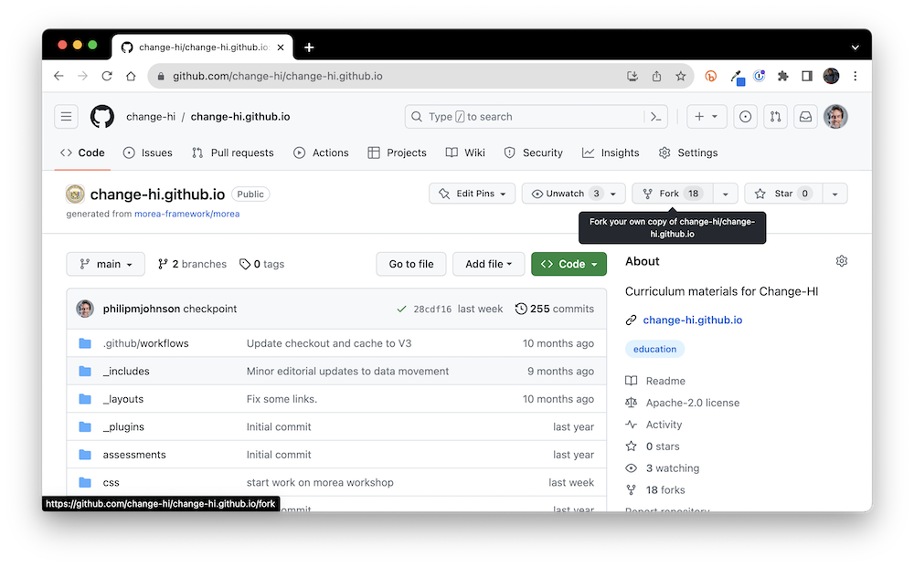
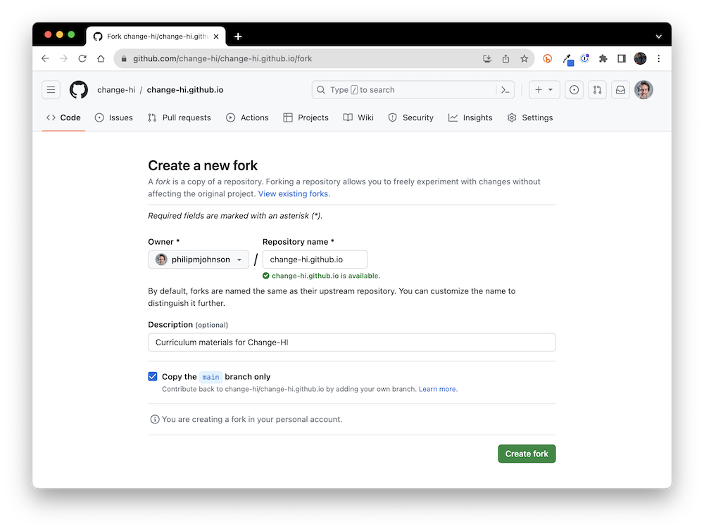

# 3. Workshop Setup

Now that you've learned a bit about best practices for workshop design, we're going to dive into the weeds with the mechanics of building a workshop for the HI-DSI workshop series. 

## Workflow overview

In general, the process looks like this:

1. You will make a *fork* of the Change-HI GitHub repository.
2. You create the contents of your workshop within your local fork.
3. When you have a version ready to use or review, you create a *pull request*. Your pull request will be reviewed by a Change-HI administrator, and if there are no significant problems, your pull request will be *merged* into the Change-HI repository.
4. After merging, your workshop is *published* and ready for use at <https://change-hi.github.io>.

<i class="fa-solid fa-circle-info fa-xl"></i> **Fork? Pull request?**

If you'd like to learn more about these concepts, see GitHub's documentation on [About Forks](https://docs.github.com/en/pull-requests/collaborating-with-pull-requests/working-with-forks/about-forks) and [Creating a Pull Request](https://docs.github.com/en/pull-requests/collaborating-with-pull-requests/proposing-changes-to-your-work-with-pull-requests/creating-a-pull-request).

Let's now step through each of these steps.

## Make a fork of change-hi.github.io

In a browser, go to <https://github.com/change-hi/change-hi.github.io>. Make sure you are logged in to your GitHub account. (If you don't have a GitHub account, you need to create one now by going to <https://github.com/join>.) The page looks like this:

Click the "Fork" button in the top right of the page to bring up the fork window:

You can see that this window selects your personal account by default, which is typically where you'll want the fork of the repository to go. Click "Create fork" which results in a new copy of the repo in your own personal account. For example:

## Login to Gitpod

We recommend that you develop your workshop using a cloud-based based package called Gitpod. Basically, Gitpod provides a unix box pre-installed with all the tools you need to develop your Morea site in the cloud. You access everything through a browser, and edit your site using a browser-based version of Visual Studio Code.  (If, at some later point, you want to switch to local development, you can find out more at [Morea Framework Local Development](https://morea-framework.github.io/docs/category/local-development)).

To start, go to <https://gitpod.io/>:


